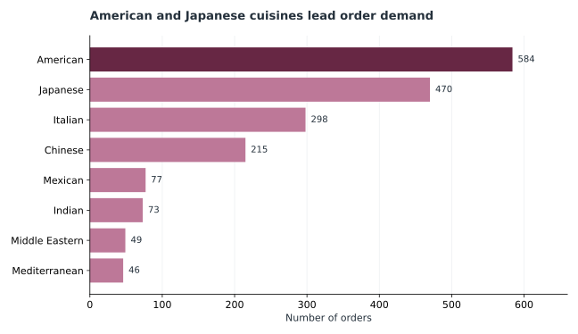
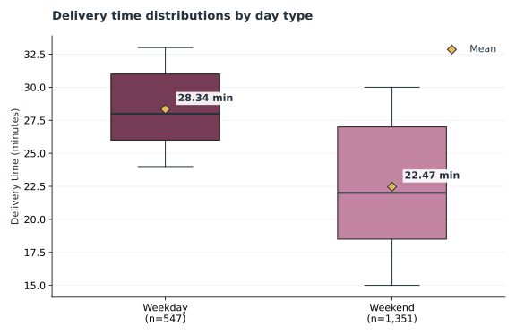
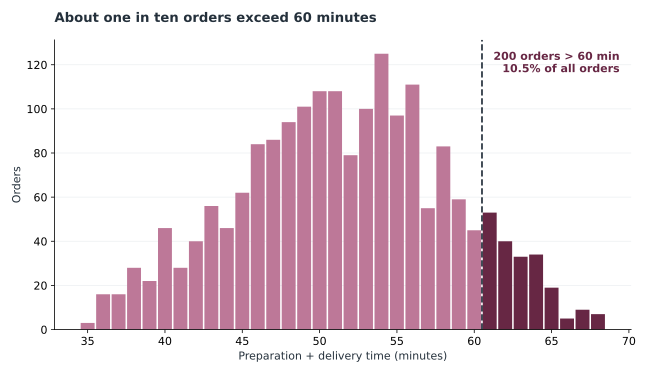
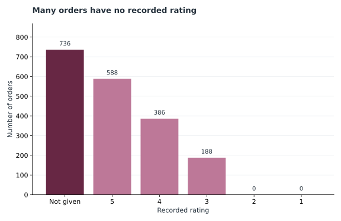

# Checked aggregate findings

These figures were recomputed from the project owner's supplied `foodhub_order (1).csv` (SHA-256 `6cf8177f2e600dd642b1122d148cf2edfade950842b2a900e67d2257c7ac7d05`). Source rows are not included in this repository.

## Visual gallery

The charts show aggregate patterns from those 1,898 orders. They are generated by [`scripts/build_gallery.py`](../scripts/build_gallery.py) using Matplotlib and can be reproduced with an authorized copy of the CSV as described in the [README](../README.md#run-locally).

### Cuisine demand

American and Japanese cuisines lead the order counts across the full dataset. These totals include both weekday and weekend orders; the American weekend subset contains 415.

### Delivery time distribution

The boxes show the middle half of observations, the line inside each box is the median, and the diamond marks the mean. Outliers are hidden for readability; all observations contribute to the means.

### Total time to delivery

The dashed boundary separates exactly 60 minutes from times strictly greater than 60 minutes. Each bar counts orders at that whole-minute total.

### Rating coverage

“Not given” is a missing rating, not a low score. Its size matters when interpreting averages from responding customers.

## Summary measures

| Measure | Result |
| --- | ---: |
| Orders / restaurants | 1,898 / 178 |
| Weekend / weekday orders | 1,351 / 547 |
| American cuisine orders on weekends | **415** |
| Mean delivery time, weekday / weekend | 28.34 / 22.47 minutes |
| Orders with preparation plus delivery over 60 minutes | 200 / 1,898 (10.54%) |
| Orders with no rating | 736 / 1,898 (38.78%) |
| Orders costing more than $20 | 555 / 1,898 (29.24%) |
| Estimated commission under the stated tier rule | $6,166.30 |

American cuisine is the largest category on weekends (415 orders), followed by Japanese (335). **1,351 is the total number of weekend orders**, not the American subset. The original HTML used `len(weekend_orders['cuisine_type'] == 'American')`, which counts all rows in the comparison; this case study counts the matching rows.

Weekday deliveries average 5.87 minutes longer than weekend deliveries in this dataset. The data do not show why. Investigating order density, distance, staffing, and time of day would be necessary before changing driver schedules.

Nearly 39% of orders have no rating. Averages among rated orders therefore describe responders, not necessarily all customers. Consider testing a gentle rating reminder, measuring response rate and potential selection bias before treating rating changes as improved service.

The estimated commission is based on the assumed tier rule and excludes fees, discounts, refunds, driver costs, and taxes. It should not be described as net revenue or profit. See [methods](methods.md) for exact thresholds and other limitations.
